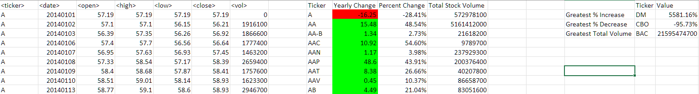
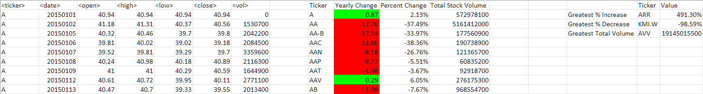

# VBA-Challenge: Charles Phil Week 2 homework

## Note before grading

For this project, I have a copy of the "Instructions" folder from the course GitLab and a separate "Testing" folder where I stored a copy of the "alphabetical_testing.xlsm" file along with a "work_in_progress.vb" file. Please do not use these files for grading. I have left these folders in the repository instead of adding them to a .gitignore in case I had issues accessing the instructions and my work across different computers over the holidays. I have removed the "Multiple_year_stock_data.xlsx" files due to their file size exceeding Github's 50 MB recommended file size limit.

## Where to access the files

To access the files to grade, open the **"Grade_Me"** folder.

Inside the folder, you will find a copy of the Visual Basic script saved as **"completed_script.vb"**. Along with the .vb file, you will find the required **screenshots of the results** for each year in the "Multiple_year_stock_data.xlsx" file. Please note that the "Multiple_year_stock_data.xlsx" file itself *is not included* due to file size limitations by Github.

## Explanation of the script

### Variables and data types

I chose each variable's data type based on what I assumed would be the maximum possible value for each one. For example, any variable involving the count of the columns would be an **integer** as I did not expect to exceed any more than 18 columns.

For the row variables, I saw that the stock data went as far as 797,711 (!!) rows, so I chose to use the **Long** data type as the maximum value for Long data is 2,147,483,647. 

Any values involving decimals were assigned the **Double** data type.

When it came time to assign a data type for the max_volume variable (for finding the total stock volume of a company for the year), I initially chose a Long data type as I assumed two billion would be sufficient enough to handle the total traded volume for each company. However, I saw that there were several companies with traded volumes way beyond that limit and I switched to using a **LongLong** data type, which has a maximum value of 9,223,372,036,854,775,807. However, because LongLong data is limited to 64-bit systems, this means my script is now limited to computers running 64-bit operating systems.

### Running the script for each sheet in the workbook

I completed the bonus challenge, which asked me to:

> Make the appropriate adjustments to your VBA script that will allow it to run on every worksheet, i.e., every year, just by running the VBA script once.

To accomplish that, I set up the For loop so that each worksheet would be initialized as "ws," meaning that all cell and range references would require the ws variable to properly refer to the current sheet.

Additionally, I have two variables which require new defaults for *each* new sheet in the loop. The row number for the outputted information *must* begin at 2 for each sheet, and the last row of the data is different between each sheet.

### Looping through the data, part 1

I opted to loop through each row, and since I knew what the last row number would be, I could set the loop to run from the beginning (excluding the header) to the end row. Because the header does not change between sheets, I opted to refer to a column based on the column number. For example, if I needed to access the ticker, I referenced column 1.

If the ticker is the first ticker of its kind, I grabbed the row number of that first ticker so that I could later refer to this position when calculating the total stock volume, as I opted to use the SUM worksheet function and required the range of values to add up. I also grabbed the value of the opening price for the first time the ticker appeared, as I will need that price when calculating the yearly change later.

### Looping through the data, part 2

Once I find where the last ticker of its kind is, I execute all of the calculations and output them to their respective places underneath the headers in the output area of the sheet.

To calculate the yearly change, we need to find the final closing price of the ticker, so I grab that value prior to outputting the change to a cell. Then, we just subtract the first opening price from the last closing price of the year.

The formula for calculating the percent change is:

> *(new value - old value) / old value \* 100*

The numerator is identical to the yearly change, and our old value was the ticker's initial opening price of the year. I reformat the decimal as a percentage later, so I do not multiply by 100 to convert from decimal to percentage.

Substituting my variables, I get:

> *yearly change / opening price*

While running the above on the test data, I came across one instance where the opening price for the year was $0. Because I had to divide by the opening price to get the percent change, this resulted in a division by zero, and therefore would crash the script. To get around this, I wrapped the percent change formula in an If statement, which will only execute the formula if the opening price is not zero. If the opening price is zero, I instead assign "NA" to the cell.

I use the Sum worksheet function to finally find the total stock volume traded for the ticker in question using the first row from part 1. 

### Formatting the output

With all the information outputted, I find and store the last row in the outputted area to use when I format the information.

I threw in the delete conditional formatting statement just in case there were other conflicting conditional formats prior to me running the script.

For column J ("Yearly Change"), if the change was greater than 0, I made the cell color green. If the change was less than 0, the cell would be red. As an edge case, I wrote that if the change was exactly 0, the fill would be gray.

I formatted column K ("Percent Change") so that the values in the Percent Change column actually showed percentages to two decimal places.

### Bonus information output

Using the newly formatted information, I opted to find the minimum and maximum percent change from column K, and stored those in variables to use later when looping through the outputted information for their correlated ticker. I did the same thing for the greatest total stock volume.

### Finding the correlated ticker for the bonus information

As I already have the maximum stock volume and the maximum and minimum percent change, all I need to do now is to loop through the outputted information to find the row that contains each value.

Because we are dealing with two outcomes for one variable (percent change), I set up an If block to check for one or the other, and then output the matching ticker into the bonus area.

I made a separate If block for the stock volume, as it could be possible for a company to have both the highest (or lowest) percent change and the biggest total stock volume.

Lastly, I run an AutoFit command on all of the newly generated columns I made. This avoids the data from looking too cluttered and promotes readability.

The script then runs again on the next available worksheet.

## Results

### 2014

### 2015

### 2016

